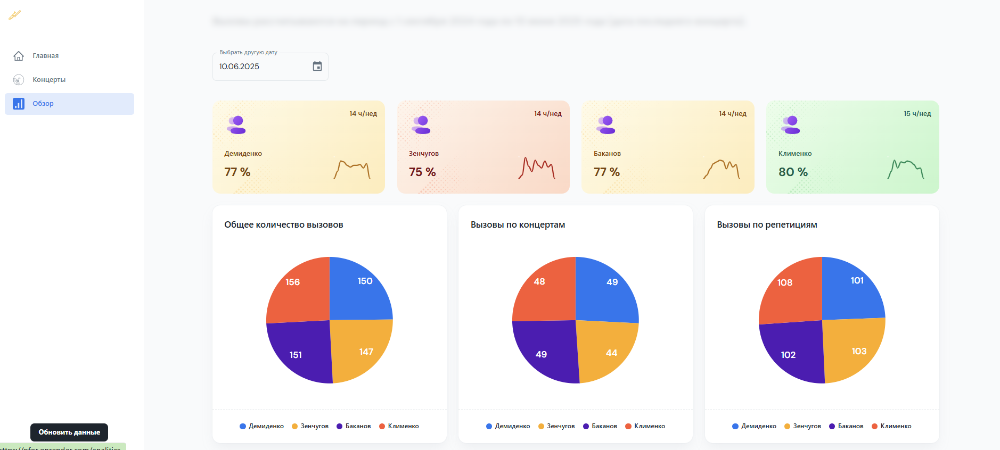

# Репозиторий для Google Sheets API проекта NFOR.

> Онлайн расписание и статистика занятости группы в оркестре. 
> Симуляция авторизации. Логин/пароль - nfor@trombones.ru/nfor_trombones
> Написан на React + Vite.js с использованием MUi, классов, модулей со следующими возможностями: загрузка, анализ и визуализация данных представленных в google sheets таблице.

## Сcылки

(Открыть ссылку в новом окне: ctrl + shift + ссылка)

- [Ссылка на выложенную на сервер работающую фронтенд часть приложения](https://nfor.onrender.com/analitics/) (Если ссылка не работает, приложение можно протестировать локально. [Ниже](#инструкция-по-развертыванию) инструкция по развертыванию).

Технологии используемые в проекте:

- React.js, Vite.js, MUI
- Адаптивная верстка
- Google Sheets scripts

### Инструкция по развертыванию:

- Клонировать проект: `git clone git@github.com:alvde-site/nfor.git`
- Рекомендуется: Node.js v20.x
- Перейти в директорию `ui` и установить зависимости: `npm i` или `yarn install`
- Запустить frontend часть приложения на 3039 порту: `npm run dev` или `yarn dev`
- Собрать приложение: `npm run build` или `yarn build`
- Открыть браузер: [http://localhost:3039](http://localhost:3039)
